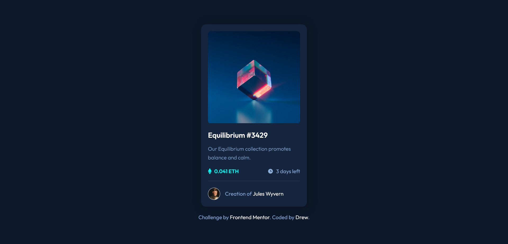

# Frontend Mentor - NFT preview card component solution

This is a solution to the [NFT preview card component challenge on Frontend Mentor](https://www.frontendmentor.io/challenges/nft-preview-card-component-SbdUL_w0U). Frontend Mentor challenges help you improve your coding skills by building realistic projects.

## Table of contents

- [Overview](#overview)
  - [The challenge](#the-challenge)
  - [Screenshot](#screenshot)
  - [Links](#links)
- [My process](#my-process)
  - [Built with](#built-with)
  - [What I learned](#what-i-learned)
- [Author](#author)

## Overview

### The challenge

Users should be able to:

- View the optimal layout depending on their device's screen size
- See hover states for interactive elements

### Screenshot

### Links

- Solution URL: [Click here](https://github.com/24FContreras/FM_PreviewCard)
- Live Site URL: [Click here](https://24FContreras.github.io/FM_PreviewCard)

---

## My process

### Built with

- Semantic HTML5 markup
- SASS (scss)
- CSS

### What I learned

In this challenge I learned how to make image overlays. This part also helped me a lot with positioning working with absolute and relative elements. I think now I have a better understanding of the mentioned properties.

---

## Author

- Frontend Mentor - [@24FContreras](https://www.frontendmentor.io/profile/24FContreras)
- Github - [@24FContreras](https://github.com/24FContreras)

Disclaimer: This user does NOT interact with NTFs in any way.
